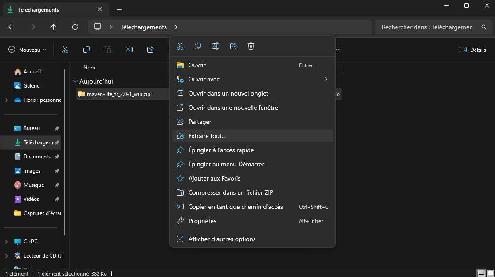
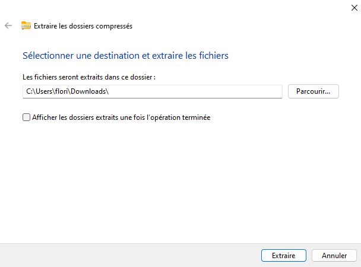
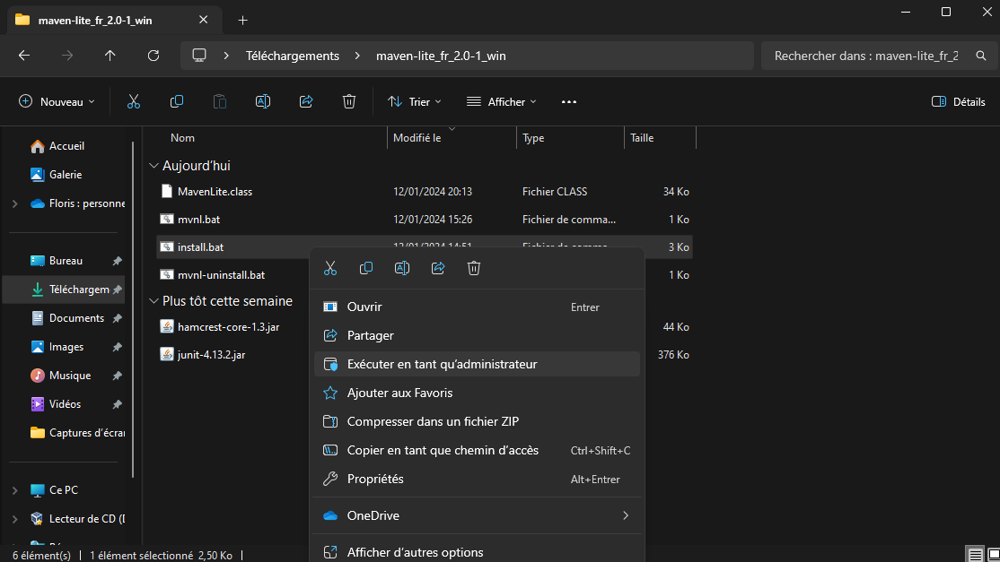
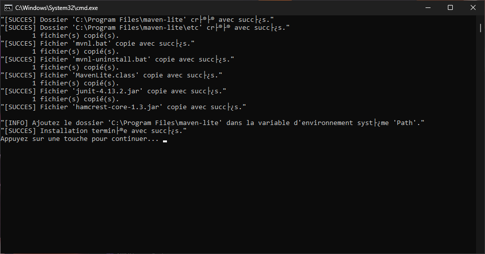

# Installation and Uninstallation of Maven Lite and its Dependencies

- Voir la [documentation Française](./Installation.fr.md)
- See the [PDF documentation](./pdf/Installation.en.pdf)

## Table of Contents

- [Installation and Uninstallation of Maven Lite and its Dependencies](#installation-and-uninstallation-of-maven-lite-and-its-dependencies)
  - [Table of Contents](#table-of-contents)
  - [Prerequisites before Installing Maven Lite](#prerequisites-before-installing-maven-lite)
    - [Prerequisites for All Linux Distributions and MacOS](#prerequisites-for-all-linux-distributions-and-macos)
    - [Prerequisites for Windows](#prerequisites-for-windows)
  - [Installing Prerequisites](#installing-prerequisites)
    - [Installing Bash](#installing-bash)
      - [Installing Bash on Debian and its Derivatives](#installing-bash-on-debian-and-its-derivatives)
      - [Installing Bash on other Linux Distributions or MacOS](#installing-bash-on-other-linux-distributions-or-macos)
    - [Installing Java](#installing-java)
      - [Installing Java on Debian and its Derivatives](#installing-java-on-debian-and-its-derivatives)
      - [Installing Java on other Linux Distributions or MacOS](#installing-java-on-other-linux-distributions-or-macos)
      - [Installing Java on Windows](#installing-java-on-windows)
  - [Maven Lite Installation](#maven-lite-installation)
    - [Installing Maven Lite on IUT du Havre Machines](#installing-maven-lite-on-iut-du-havre-machines)
    - [Maven Lite Installation on Debian and its Derivatives](#maven-lite-installation-on-debian-and-its-derivatives)
      - [Automatic Installation of Maven Lite - Debian](#automatic-installation-of-maven-lite---debian)
      - [Manual Installation of Maven Lite - Debian](#manual-installation-of-maven-lite---debian)
    - [Maven Lite Installation on Other Linux Distributions or MacOS](#maven-lite-installation-on-other-linux-distributions-or-macos)
      - [Automatic Installation of Maven Lite - Linux \& MacOS](#automatic-installation-of-maven-lite---linux--macos)
      - [Manual Installation of Maven Lite - Linux \& MacOS](#manual-installation-of-maven-lite---linux--macos)
    - [Maven Lite Installation on Windows](#maven-lite-installation-on-windows)
      - [Automatic Installation of Maven Lite - Windows](#automatic-installation-of-maven-lite---windows)
      - [Manual Installation of Maven Lite - Windows](#manual-installation-of-maven-lite---windows)
  - [Maven Lite Uninstallation](#maven-lite-uninstallation)
    - [Maven Lite Uninstallation on Debian and its Derivatives](#maven-lite-uninstallation-on-debian-and-its-derivatives)
      - [Automatic Uninstallation of Maven Lite - Debian](#automatic-uninstallation-of-maven-lite---debian)
      - [Manual Uninstallation of Maven Lite - Debian](#manual-uninstallation-of-maven-lite---debian)
    - [Maven Lite Uninstallation on Other Linux Distributions or MacOS](#maven-lite-uninstallation-on-other-linux-distributions-or-macos)
      - [Automatic Uninstallation of Maven Lite - Linux \& MacOS](#automatic-uninstallation-of-maven-lite---linux--macos)
      - [Manual Uninstallation of Maven Lite - Linux \& MacOS](#manual-uninstallation-of-maven-lite---linux--macos)
    - [Maven Lite Uninstallation on Windows](#maven-lite-uninstallation-on-windows)
      - [Automatic Uninstallation of Maven Lite - Windows](#automatic-uninstallation-of-maven-lite---windows)
      - [Manual Uninstallation of Maven Lite - Windows](#manual-uninstallation-of-maven-lite---windows)

**If you want to uninstall Maven Lite, you can [skip directly to the uninstallation of Maven Lite](#maven-lite-uninstallation).**

## Prerequisites before Installing Maven Lite

### Prerequisites for All Linux Distributions and MacOS

- [Bash](#installing-bash)
- [Java 17 or higher](#installing-java)

### Prerequisites for Windows

- [Java 17 or higher](#installing-java-on-windows)

## Installing Prerequisites

**If you have already installed the prerequisites, you can [skip directly to the installation of Maven Lite](#maven-lite-installation).**

### Installing Bash

#### Installing Bash on Debian and its Derivatives

- Run the following command

  ```sh
  sudo apt install bash
  ```

#### Installing Bash on other Linux Distributions or MacOS

- Download the bash installation file by running the following command

  ```sh
  /bin/bash -c "$(curl -fsSL https://raw.githubusercontent.com/Homebrew/install/HEAD/install.sh)"
  ```

- Run the following command to add the bash installation directory to zprofile

  ```sh
  echo 'eval "$(/opt/homebrew/bin/brew shellenv)"' >> ~/.zprofile
  ```

- Run the following command to install bash

  ```sh
  brew install bash
  ```

- Verify that bash is installed by running the following command

  ```sh
  bash --version
  ```

### Installing Java

#### Installing Java on Debian and its Derivatives

- Run the following command

  ```sh
  sudo apt install openjdk-17-jdk openjdk-17-jre
  ```

#### Installing Java on other Linux Distributions or MacOS

- Go to the [official Oracle website](https://www.oracle.com/java/technologies/javase/jdk17-archive-downloads.html)
- Download the java 17 installer for your Linux distribution or MacOS version. This guide doesn't cover installation with a compressed file.
- Once the installer is downloaded, run it.
- Follow the instructions of the installer.
- Once the installation is complete, you can delete the installer if you wish.

#### Installing Java on Windows

- Download the java 17 installer file for Windows from the official Oracle website by clicking [here](https://download.oracle.com/java/17/archive/jdk-17.0.9_windows-x64_bin.exe).
- Once the '`jdk-17.0.9_windows-x64_bin.exe`' installer is downloaded, double-click to run it.
- Follow the instructions of the installer.
- Once the installation is complete, you can delete the installer if you wish.

## Maven Lite Installation

**Follow the instructions corresponding to your operating system.**

- [IUT Le Havre](#installation-de-maven-lite-sur-les-machines-de-liut-du-havre)
- [Debian and its derivatives](#maven-lite-installation-on-debian-and-its-derivatives)
- [Linux and MacOS](#maven-lite-installation-on-other-linux-distributions-or-macos)
- [Windows](#maven-lite-installation-on-windows)

### Installing Maven Lite on IUT du Havre Machines

- Download the [Compressed File of the French Version](https://github.com/FloRobart/mavenlite.github.io/releases/download/v2.0.0/maven-lite_fr_2.0-1_lh-iut.zip) containing the application files.
- Decompress the compressed file.
- Open a terminal in the directory containing the application files.
- Make the `install.sh` file executable if it's not already.

  ```sh
  chmod +x install.sh
  ```

- Run the `install.sh` file.

  ```sh
  ./install.sh
  ```

- You can delete the remaining unused files.

### Maven Lite Installation on Debian and its Derivatives

#### Automatic Installation of Maven Lite - Debian

- Download the [Debian file for the French version](https://github.com/FloRobart/mavenlite.github.io/releases/download/v2.0.0/maven-lite_fr_2.0-1_all.deb)
- Execute the Debian file

  ```sh
  sudo dpkg -i maven-lite_fr_2.0-1_all.deb
  ```

- Once the installation is complete, you can delete the file `maven-lite_<language>_2.0-1_all.deb` if you wish.

#### Manual Installation of Maven Lite - Debian

- Download the [Compressed file of the French version](https://github.com/FloRobart/mavenlite.github.io/releases/download/v2.0.0/maven-lite_fr_2.0-1_linux-macos.zip) containing the application files.
- Unzip the compressed file.
- Create the folder `/usr/local/etc/maven-lite`

  ```sh
  sudo mkdir -p /usr/local/etc/maven-lite
  ```

- Move the .class and .jar files to the `/usr/local/etc/maven-lite` folder

  ```sh
  sudo mv hamcrest-core-1.3.jar /usr/local/etc/maven-lite/
  sudo mv junit-4.13.2.jar /usr/local/etc/maven-lite/
  sudo mv MavenLite.class /usr/local/etc/maven-lite/
  ```

- Move the shell files to the `/usr/local/bin` folder

  ```sh
  sudo mv mvnl /usr/local/bin/
  sudo mv mvnl-uninstall /usr/local/bin/
  ```

- Add execution rights to the `mvnl` and `mvnl-uninstall` files

  ```sh
  sudo chmod +x /usr/local/bin/mvnl*
  ```

- Move the `mvnl.1.gz` file to the `/usr/local/man/fr/man1` folder to have manual pages

  ```sh
  sudo mv mvnl.1.gz /usr/local/man/fr/man1/
  ```

- You can delete the remaining unused files.

### Maven Lite Installation on Other Linux Distributions or MacOS

#### Automatic Installation of Maven Lite - Linux & MacOS

- Download the [Compressed file of the French version](https://github.com/FloRobart/mavenlite.github.io/releases/download/v2.0.0/maven-lite_fr_2.0-1_linux-macos.zip) containing the application files.
- Unzip the compressed file.
- Run the installation script by executing the following command in a terminal

  ```sh
  sudo ./installer.sh
  ```

- You can delete the remaining unused files.

#### Manual Installation of Maven Lite - Linux & MacOS

- Download the [Compressed file of the French version](https://github.com/FloRobart/mavenlite.github.io/releases/download/v2.0.0/maven-lite_fr_2.0-1_linux-macos.zip) containing the application files.
- Unzip the compressed file.
- Create the folder `/usr/local/etc/maven-lite`

  ```sh
  sudo mkdir -p /usr/local/etc/maven-lite
  ```

- Move the .class and .jar files to the `/usr/local/etc/maven-lite` folder

  ```sh
  sudo mv hamcrest-core-1.3.jar /usr/local/etc/maven-lite/
  sudo mv junit-4.13.2.jar /usr/local/etc/maven-lite/
  sudo mv MavenLite.class /usr/local/etc/maven-lite/
  ```

- Move the shell files to the `/usr/local/bin` folder

  ```sh
  sudo mv mvnl /usr/local/bin/
  sudo mv mvnl-uninstall /usr/local/bin/
  ```

- Add execution rights to the `mvnl` and `mvnl-uninstall` files

  ```sh
  sudo chmod +x /usr/local/bin/mvnl*
  ```

- Move the `mvnl.1.gz` file to the `/usr/local/man/fr/man1` folder to have manual pages

  ```sh
  sudo mv mvnl.1.gz /usr/local/man/fr/man1/
  ```

- You can delete the remaining unused files.

### Maven Lite Installation on Windows

#### Automatic Installation of Maven Lite - Windows

- Download the [Compressed file of the French version](https://github.com/FloRobart/mavenlite.github.io/releases/download/v2.0.0/maven-lite_fr_2.0-1_win.zip) containing the application files.
- Unzip the compressed file by right-clicking on the file and clicking on `Extract all...`
  
- Confirm the extraction to the folder of your choice by clicking on `Extract`
  
- Run the `installer.bat` installation script by right-clicking on it and selecting `Run as administrator`
  
- You should see a command window open and display text similar to this
  
- Press any key to close the command window
- Add the `C:\Program Files\Maven Lite` folder to the system `PATH` environment variable
  - If you don't know how to do this, execute the command below or follow these steps or follow [this tutorial](https://wiki.gamedevalliance.fr/contribuer/path/)
    - Open the Start menu
    - Type `environment variables` and click on `Edit the system environment variables`
    - Click on `Environment Variables...`
    - Select the system variable `Path` and click on `Edit...`
    - Click on `New`
    - Type `C:\Program Files\Maven Lite` and click on `OK`
    - Click on `OK`
    - Click on `OK`
  - Execute the following command in a PowerShell terminal as an administrator

  ```powershell
  SETX PATH "%PATH%;C:\Program Files\Maven Lite"
  ```

- You can delete the remaining unused files as well as the compressed file.

#### Manual Installation of Maven Lite - Windows

- Download the [Compressed file of the French version](https://github.com/FloRobart/mavenlite.github.io/releases/download/v2.0.0/maven-lite_fr_2.0-1_win.zip) containing the application files.
- Unzip the compressed file by right-clicking on the file and clicking on `Extract all...`
  
- Confirm the extraction to the folder of your choice by clicking on `Extract`
  
- Create the `C:\Program Files\Maven Lite` folder

  ```powershell
  mkdir 'C:\Program Files\Maven Lite'
  ```

- Create the `C:\Program Files\Maven Lite\etc` folder

  ```powershell
  mkdir 'C:\Program Files\Maven Lite\etc'
  ```

- Move the .class and .jar files to the `C:\Program Files\Maven Lite\etc` folder

  ```powershell
  MOVE hamcrest-core-1.3.jar 'C:\Program Files\Maven Lite\etc'
  MOVE junit-4.13.2.jar 'C:\Program Files\Maven Lite\etc'
  MOVE MavenLite.class 'C:\Program Files\Maven Lite\etc'
  ```

- Move the Batch files to the `C:\Program Files\Maven Lite` folder

  ```powershell
  MOVE mvnl.bat 'C:\Program Files\Maven Lite'
  MOVE mvnl-uninstall.bat 'C:\Program Files\Maven Lite'
  ```

- Add the `C:\Program Files\Maven Lite` folder to the system `PATH` environment variable
  - If you don't know how to do this, follow these steps or follow [this tutorial](https://wiki.gamedevalliance.fr/contribuer/path/)
    - Open the Start menu
    - Type `environment variables` and click on `Edit the system environment variables`
    - Click on `Environment Variables...`
    - Select the system variable `Path` and click on `Edit...`
    - Click on `C:\Program Files\Maven Lite` and click on `Remove`
    - Click on `OK`
    - Click on `OK`
    - Click on `OK`
  - Execute the following command in a PowerShell terminal as an administrator

  ```powershell
  SETX PATH "%PATH%;C:\Program Files\Maven Lite"
  ```

- Delete the remaining unused files as well as the compressed file.

## Maven Lite Uninstallation

**Follow the instructions corresponding to your operating system.**

- [Debian and its derivatives](#maven-lite-uninstallation-on-debian-and-its-derivatives)
- [Linux and MacOS](#maven-lite-uninstallation-on-other-linux-distributions-or-macos)
- [Windows](#maven-lite-uninstallation-on-windows)

### Maven Lite Uninstallation on Debian and its Derivatives

#### Automatic Uninstallation of Maven Lite - Debian

- First method
  - Execute the following command

    ```sh
    mvnl-uninstall
    ```

- Second method
  - Execute the following command

    ```sh
    sudo dpkg -r mvnl
    ```

#### Manual Uninstallation of Maven Lite - Debian

- Delete the `/usr/local/etc/maven-lite` folder

  ```sh
  sudo rm -r /usr/local/etc/maven-lite
  ```

- Delete the shell files

  ```sh
  sudo rm /usr/local/bin/mvnl /usr/local/bin/mvnl-uninstall
  ```

- Delete the manual pages

  ```sh
  sudo rm /usr/local/man/fr/man1/mvnl.1.gz /usr/local/man/en/man1/mvnl.1.gz
  ```

### Maven Lite Uninstallation on Other Linux Distributions or MacOS

#### Automatic Uninstallation of Maven Lite - Linux & MacOS

- Execute the following command

  ```sh
  mvnl-uninstall
  ```

#### Manual Uninstallation of Maven Lite - Linux & MacOS

- Delete the `/usr/local/etc/maven-lite` folder

  ```sh
  sudo rm -r /usr/local/etc/maven-lite
  ```

- Delete the shell files

  ```sh
  sudo rm /usr/local/bin/mvnl /usr/local/bin/mvnl-uninstall
  ```

- Delete the manual pages

  ```sh
  sudo rm /usr/local/share/man/fr/man1/mvnl.1.gz /usr/local/share/man/en/man1/mvnl.1.gz
  ```

### Maven Lite Uninstallation on Windows

#### Automatic Uninstallation of Maven Lite - Windows

- Execute the following command in a PowerShell terminal as an administrator

  ```powershell
  mvnl-uninstall
  ```

#### Manual Uninstallation of Maven Lite - Windows

- Delete the `C:\Program Files\Maven Lite` folder by executing the following command in a PowerShell terminal

  ```powershell
  rmdir 'C:\Program Files\Maven Lite'
  ```

- Confirm the deletion by typing `Y`
- Remove the `C:\Program Files\Maven Lite\` folder from the system `PATH` environment variable
  - If you don't know how to do this, follow these steps or follow [this tutorial](https://wiki.gamedevalliance.fr/contribuer/path/)
    - Open the Start menu
    - Type `environment variables` and click on `Edit the system environment variables`
    - Click on `Environment Variables...`
    - Select the system variable `Path` and click on `Edit...`
    - Click on `C:\Program Files\Maven Lite` and click on `Remove`
    - Click on `OK`
    - Click on `OK`
    - Click on `OK`

<a href="https://florobart.github.io/mavenlite.github.io/Documentations/README.en.html"><button type="button">Retour</button></a>
