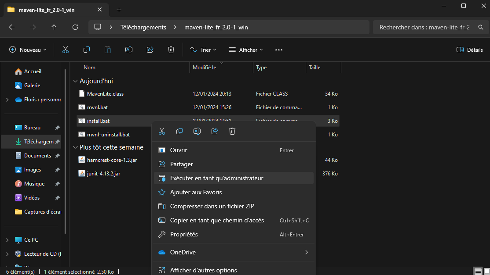

# Installation et désinstallation de Maven Lite et de ses dépendances

- See the [English documentation](./Installation.en.md)
- Voir la [documentation en PDF](./pdf/Installation.fr.pdf)

## Table des matières

- [Installation et désinstallation de Maven Lite et de ses dépendances](#installation-et-désinstallation-de-maven-lite-et-de-ses-dépendances)
  - [Table des matières](#table-des-matières)
  - [Prérequis avant l'installation de Maven Lite](#prérequis-avant-linstallation-de-maven-lite)
    - [Prérequis pour Toutes les distributions Linux et MacOs](#prérequis-pour-toutes-les-distributions-linux-et-macos)
    - [Prérequis pour Windows](#prérequis-pour-windows)
  - [Installation des prérequis](#installation-des-prérequis)
    - [Installation de bash](#installation-de-bash)
      - [Installer bash sur Debian et ses dérivés](#installer-bash-sur-debian-et-ses-dérivés)
      - [Installer Bash sur d'autre distributions Linux ou sur MacOs](#installer-bash-sur-dautre-distributions-linux-ou-sur-macos)
    - [Installation de java](#installation-de-java)
      - [Installation de java sur Debian et ses dérivés](#installation-de-java-sur-debian-et-ses-dérivés)
      - [Installation de java sur d'autre distributions Linux ou sur MacOs](#installation-de-java-sur-dautre-distributions-linux-ou-sur-macos)
      - [Installation de java sur Windows](#installation-de-java-sur-windows)
  - [Installation de Maven Lite](#installation-de-maven-lite)
    - [Installation de Maven Lite sur les machines de l'IUT du Havre](#installation-de-maven-lite-sur-les-machines-de-liut-du-havre)
    - [Installation de Maven Lite sur Debian et ses dérivés](#installation-de-maven-lite-sur-debian-et-ses-dérivés)
      - [Installation automatique de Maven Lite - Debian](#installation-automatique-de-maven-lite---debian)
      - [Installation manuelle de Maven Lite - Debian](#installation-manuelle-de-maven-lite---debian)
    - [Installation de Maven Lite sur d'autres distributions Linux ou sur MacOs](#installation-de-maven-lite-sur-dautres-distributions-linux-ou-sur-macos)
      - [Installation automatique de Maven Lite - Linux \& MacOs](#installation-automatique-de-maven-lite---linux--macos)
      - [Installation manuelle de Maven Lite - Linux \& MacOs](#installation-manuelle-de-maven-lite---linux--macos)
    - [Installation de Maven Lite sur Windows](#installation-de-maven-lite-sur-windows)
      - [Installation automatique de Maven Lite - Windows](#installation-automatique-de-maven-lite---windows)
      - [Installation manuelle de Maven Lite - Windows](#installation-manuelle-de-maven-lite---windows)
  - [Désinstallation de Maven Lite](#désinstallation-de-maven-lite)
    - [Désinstallation de Maven Lite sur Debian et ses dérivés](#désinstallation-de-maven-lite-sur-debian-et-ses-dérivés)
      - [Désinstallation automatique de Maven Lite - Debian](#désinstallation-automatique-de-maven-lite---debian)
      - [Désinstallation manuelle de Maven Lite - Debian](#désinstallation-manuelle-de-maven-lite---debian)
    - [Désinstallation de Maven Lite sur d'autres distributions Linux ou sur MacOs](#désinstallation-de-maven-lite-sur-dautres-distributions-linux-ou-sur-macos)
      - [Désinstallation automatique de Maven Lite - Linux \& MacOs](#désinstallation-automatique-de-maven-lite---linux--macos)
      - [Désinstallation manuelle de Maven Lite - Linux \& MacOs](#désinstallation-manuelle-de-maven-lite---linux--macos)
    - [Désinstallation de Maven Lite sur Windows](#désinstallation-de-maven-lite-sur-windows)
      - [Désinstallation automatique de Maven Lite - Windows](#désinstallation-automatique-de-maven-lite---windows)
      - [Désinstallation manuelle de Maven Lite - Windows](#désinstallation-manuelle-de-maven-lite---windows)

**Si vous voulez désinstaller Maven Lite, vous pouvez [passer directement à la désinstallation de Maven Lite](#désinstallation-de-maven-lite).**

## Prérequis avant l'installation de Maven Lite

### Prérequis pour Toutes les distributions Linux et MacOs

- [Bash](#installation-de-bash)
- [Java 17 ou supérieur](#installation-de-java)

### Prérequis pour Windows

- [Java 17 ou supérieur](#installation-de-java-sur-windows)

## Installation des prérequis

**Si vous avez déjà installé les prérequis, vous pouvez [passer directement à l'installation de Maven Lite](#installation-de-maven-lite).**

### Installation de bash

#### Installer bash sur Debian et ses dérivés

- Éxécutez la commande suivante

  ```sh
  sudo apt install bash
  ```

#### Installer Bash sur d'autre distributions Linux ou sur MacOs

- Téléchargez le fichier d'installation de bash en éxécutant la commande suivante

  ```sh
  /bin/bash -c "$(curl -fsSL https://raw.githubusercontent.com/Homebrew/install/HEAD/install.sh)"
  ```

- Éxécutez la commande suivante pour ajouter le dossier d'installation de bash au zprofile

  ```sh
  echo 'eval "$(/opt/homebrew/bin/brew shellenv)"' >> ~/.zprofile
  ```

- Éxécutez la commande suivante pour installer bash

  ```sh
  brew install bash
  ```

- Vérifiez que bash est bien installé en éxécutant la commande suivante

  ```sh
  bash --version
  ```

### Installation de java

#### Installation de java sur Debian et ses dérivés

- Éxécutez la commande suivante

  ```sh
  sudo apt install openjdk-17-jdk openjdk-17-jre
  ```

#### Installation de java sur d'autre distributions Linux ou sur MacOs

- Allez sur le [site officiel d'Oracle](https://www.oracle.com/java/technologies/javase/jdk17-archive-downloads.html)
- Téléchargez l'installateur de java 17 pour votre distribution Linux ou votre version de MacOs. Se petit guide d'installation de java ne traite pas de l'installation avec un fichier compressé.
- Une fois l'installateur téléchargé, éxécutez le.
- Suivez les instructions de l'installateur.
- Une fois l'installation terminée, vous pouvez supprimer l'installateur si vous le souhaitez.

#### Installation de java sur Windows

- Téléchargez le fichier d'installation de java 17 pour Windows sur le site officiel d'Oracle en cliquant [ici](https://download.oracle.com/java/17/archive/jdk-17.0.9_windows-x64_bin.exe).
- Une fois l'installateur '`jdk-17.0.9_windows-x64_bin.exe`' téléchargé, éxécutez le en double cliquant dessus.
- Suivez les instructions de l'installateur.
- Une fois l'installation terminée, vous pouvez supprimer l'installateur si vous le souhaitez.

## Installation de Maven Lite

**Suivez les instructions correspondant à votre système d'exploitation.**

- [IUT Le Havre](#installation-de-maven-lite-sur-les-machines-de-liut-du-havre)
- [Debian et ses dérivés](#installation-de-maven-lite-sur-debian-et-ses-dérivés)
- [Linux et MacOs](#installation-de-maven-lite-sur-dautres-distributions-linux-ou-sur-macos)
- [Windows](#installation-de-maven-lite-sur-windows)

### Installation de Maven Lite sur les machines de l'IUT du Havre

- Téléchargez le [Fichier compressé de la version française](https://github.com/FloRobart/mavenlite.github.io/releases/download/v2.0.0/maven-lite_fr_2.0-1_lh-iut.zip) contenant les fichiers de l'applications.
- Décompressez le fichier compressé
- Ouvrez un terminal dans le dossier contenant les fichiers de l'applications
- Rendez le fichier `install.sh` exécutable s'il ne l'est pas déjà

  ```sh
  chmod +x install.sh
  ```

- Lancez le fichier `install.sh`

  ```sh
  ./install.sh
  ```

- Vous pouvez supprimez le reste des fichiers inutilisés.

### Installation de Maven Lite sur Debian et ses dérivés

#### Installation automatique de Maven Lite - Debian

- Téléchargez le [fichier debian de la version française](https://github.com/FloRobart/mavenlite.github.io/releases/download/v2.0.0/maven-lite_fr_2.0-1_all.deb)
- Éxécutez le fichier debian

  ```sh
  sudo dpkg -i maven-lite_fr_2.0-1_all.deb
  ```

- Une fois l'installation terminée, vous pouvez supprimer le fichier `maven-lite_<langue>_2.0-1_all.deb` si vous le souhaitez.

#### Installation manuelle de Maven Lite - Debian

- Téléchargez le [Fichier compressé de la version française](https://github.com/FloRobart/mavenlite.github.io/releases/download/v2.0.0/maven-lite_fr_2.0-1_linux-macos.zip) contenant les fichiers de l'applications.
- Décompressez le fichier compressé
- Créez le dossier `/usr/local/etc/maven-lite`

  ```sh
  sudo mkdir -p /usr/local/etc/maven-lite
  ```

- Déplacez les fichiers .class et .jar dans le dossier `/usr/local/etc/maven-lite`

  ```sh
  sudo mv hamcrest-core-1.3.jar /usr/local/etc/maven-lite/
  sudo mv junit-4.13.2.jar /usr/local/etc/maven-lite/
  sudo mv MavenLite.class /usr/local/etc/maven-lite/
  ```

- Déplacez les fichiers shell dans le dossier `/usr/local/bin`

  ```sh
  sudo mv mvnl /usr/local/bin/
  sudo mv mvnl-uninstall /usr/local/bin/
  ```

- Ajoutez les droits d'exécution au fichier `mvnl` et `mvnl-uninstall`

  ```sh
  sudo chmod +x /usr/local/bin/mvnl*
  ```

- Déplacez le fichier `mvnl.1.gz` dans le dossier `/usr/local/man/fr/man1` pour avoir les pages de manuel

  ```sh
  sudo mv mvnl.1.gz /usr/local/man/fr/man1/
  ```

- Vous pouvez supprimez le reste des fichiers inutilisés.

### Installation de Maven Lite sur d'autres distributions Linux ou sur MacOs

#### Installation automatique de Maven Lite - Linux & MacOs

- Téléchargez le [Fichier compressé de la version française](https://github.com/FloRobart/mavenlite.github.io/releases/download/v2.0.0/maven-lite_fr_2.0-1_linux-macos.zip) contenant les fichiers de l'applications.
- Décompressez le fichier compressé
- Éxecuter le script d'installation en éxécutant la commande suivante dans un terminal

  ```sh
  sudo ./installer.sh
  ```

- Vous pouvez supprimez le reste des fichiers inutilisés.

#### Installation manuelle de Maven Lite - Linux & MacOs

- Téléchargez le [Fichier compressé de la version française](https://github.com/FloRobart/mavenlite.github.io/releases/download/v2.0.0/maven-lite_fr_2.0-1_linux-macos.zip) contenant les fichiers de l'applications.
- Décompressez le fichier compressé
- Créez le dossier `/usr/local/etc/maven-lite`

  ```sh
  sudo mkdir -p /usr/local/etc/maven-lite
  ```

- Déplacez les fichiers .class et .jar dans le dossier `/usr/local/etc/maven-lite`

  ```sh
  sudo mv hamcrest-core-1.3.jar /usr/local/etc/maven-lite/
  sudo mv junit-4.13.2.jar /usr/local/etc/maven-lite/
  sudo mv MavenLite.class /usr/local/etc/maven-lite/
  ```

- Déplacez les fichiers shell dans le dossier `/usr/local/bin`

  ```sh
  sudo mv mvnl /usr/local/bin/
  sudo mv mvnl-uninstall /usr/local/bin/
  ```

- Ajoutez les droits d'exécution au fichier `mvnl` et `mvnl-uninstall`

  ```sh
  sudo chmod +x /usr/local/bin/mvnl*
  ```

- Déplacez le fichier `mvnl.1.gz` dans le dossier `/usr/local/man/fr/man1` pour avoir les pages de manuel

  ```sh
  sudo mv mvnl.1.gz /usr/local/man/fr/man1/
  ```

- Vous pouvez supprimez le reste des fichiers inutilisés.

### Installation de Maven Lite sur Windows

#### Installation automatique de Maven Lite - Windows

- Téléchargez le [Fichier compressé de la version française](https://github.com/FloRobart/mavenlite.github.io/releases/download/v2.0.0/maven-lite_fr_2.0-1_win.zip) contenant les fichiers de l'applications.
- Décompressez le fichier compressé en faisant un clic droit sur le fichier et en cliquant sur `Extraire tout...`
  
- Validez la décompression dans le dossier de votre choix en cliquant sur `Extraire`
  
- Éxecuter le script d'installation `installer.bat` en faisant un clic droit dessus et en cliquant sur `Exécuter en tant qu'administrateur`
  
- Vous devriez voir une fenêtre de commande s'ouvrir et afficher un texte ressemblant à celui-ci
  
- Appuyez sur n'importe quelle touche pour fermer la fenêtre de commande
- Ajoutez le dossier `C:\Program Files\Maven Lite` à la variable d'environnement système `PATH`
  - Si vous ne savez pas comment faire éxactué la commande qui se trouve ci-dessous ou suivez les étapes suivantes ou suivez [ce tutoriel](https://wiki.gamedevalliance.fr/contribuer/path/)
    - Ouvrez le menu démarrer
    - Tapez `variables d'environnement` et cliquez sur `Modifier les variables d'environnement système`
    - Cliquez sur `Variables d'environnement...`
    - Sélectionnez la variable système `Path` et cliquez sur `Modifier...`
    - Cliquez sur `Nouveau`
    - Tapez `C:\Program Files\Maven Lite` et cliquez sur `OK`
    - Cliquez sur `OK`
    - Cliquez sur `OK`
  - Éxécutez la commande suivante dans un terminal powershell en tant qu'administrateur

  ```powershell
  SETX PATH "%PATH%;C:\Program Files\Maven Lite"
  ```

- Vous pouvez supprimez le reste des fichiers inutilisés ainsi que le fichier compressé.

#### Installation manuelle de Maven Lite - Windows

- Téléchargez le [Fichier compressé de la version française](https://github.com/FloRobart/mavenlite.github.io/releases/download/v2.0.0/maven-lite_fr_2.0-1_win.zip) contenant les fichiers de l'applications.
- Décompressez le fichier compressé en faisant un clic droit sur le fichier et en cliquant sur `Extraire tout...`
  
- Validez la décompression dans le dossier de votre choix en cliquant sur `Extraire`
  
- Créez le dossier `C:\Program Files\Maven Lite`

  ```powershell
  mkdir 'C:\Program Files\Maven Lite'
  ```

- Créez le dossier `C:\Program Files\Maven Lite\etc`

  ```powershell
  mkdir 'C:\Program Files\Maven Lite\etc'
  ```

- Déplacez les fichiers .class et .jar dans le dossier `C:\Program Files\Maven Lite\etc`

  ```powershell
  MOVE hamcrest-core-1.3.jar 'C:\Program Files\Maven Lite\etc'
  MOVE junit-4.13.2.jar 'C:\Program Files\Maven Lite\etc'
  MOVE MavenLite.class 'C:\Program Files\Maven Lite\etc'
  ```

- Déplacez les fichiers Batch dans le dossier `C:\Program Files\Maven Lite`

  ```powershell
  MOVE mvnl.bat 'C:\Program Files\Maven Lite'
  MOVE mvnl-uninstall.bat 'C:\Program Files\Maven Lite'
  ```

- Ajoutez le dossier `C:\Program Files\Maven Lite` à la variable d'environnement système `PATH`
  - Si vous ne savez pas comment faire éxactué la commande qui se trouve ci-dessous ou suivez les étapes suivantes ou suivez [ce tutoriel](https://wiki.gamedevalliance.fr/contribuer/path/)
    - Ouvrez le menu démarrer
    - Tapez `variables d'environnement` et cliquez sur `Modifier les variables d'environnement système`
    - Cliquez sur `Variables d'environnement...`
    - Sélectionnez la variable système `Path` et cliquez sur `Modifier...`
    - Cliquez sur `Nouveau`
    - Tapez `C:\Program Files\Maven Lite` et cliquez sur `OK`
    - Cliquez sur `OK`
    - Cliquez sur `OK`
  - Éxécutez la commande suivante dans un terminal powershell en tant qu'administrateur

  ```powershell
  SETX PATH "%PATH%;C:\Program Files\Maven Lite"
  ```

## Désinstallation de Maven Lite

**Suivez les instructions correspondant à votre système d'exploitation.**

- [Debian et ses dérivés](#désinstallation-de-maven-lite-sur-debian-et-ses-dérivés)
- [Linux et MacOs](#désinstallation-de-maven-lite-sur-dautres-distributions-linux-ou-sur-macos)
- [Windows](#désinstallation-de-maven-lite-sur-windows)

### Désinstallation de Maven Lite sur Debian et ses dérivés

#### Désinstallation automatique de Maven Lite - Debian

- Première méthode
  - Éxécutez la commande suivante

    ```sh
    mvnl-uninstall
    ```

- Deuxième méthode
  - Éxécutez la commande suivante

    ```sh
    sudo dpkg -r mvnl
    ```

#### Désinstallation manuelle de Maven Lite - Debian

- Supprimez le dossier `/usr/local/etc/maven-lite`

  ```sh
  sudo rm -r /usr/local/etc/maven-lite
  ```

- Supprimez les fichiers shell

  ```sh
  sudo rm /usr/local/bin/mvnl /usr/local/bin/mvnl-uninstall
  ```

- Supprimez les pages de manuel

  ```sh
  sudo rm /usr/local/man/fr/man1/mvnl.1.gz /usr/local/man/en/man1/mvnl.1.gz
  ```

### Désinstallation de Maven Lite sur d'autres distributions Linux ou sur MacOs

#### Désinstallation automatique de Maven Lite - Linux & MacOs

- Éxécutez la commande suivante

  ```sh
  mvnl-uninstall
  ```

#### Désinstallation manuelle de Maven Lite - Linux & MacOs

- Supprimez le dossier `/usr/local/etc/maven-lite`

  ```sh
  sudo rm -r /usr/local/etc/maven-lite
  ```

- Supprimez les fichiers shell

  ```sh
  sudo rm /usr/local/bin/mvnl /usr/local/bin/mvnl-uninstall
  ```

- Supprimez les pages de manuel

  ```sh
  sudo rm /usr/local/share/man/fr/man1/mvnl.1.gz /usr/local/share/man/en/man1/mvnl.1.gz
  ```

### Désinstallation de Maven Lite sur Windows

#### Désinstallation automatique de Maven Lite - Windows

- Éxécutez la commande suivante dans un terminal powershell en tant qu'administrateur

  ```powershell
  mvnl-uninstall
  ```

#### Désinstallation manuelle de Maven Lite - Windows

- Supprimez le dossier `C:\Program Files\Maven Lite` en éxécutant la commande suivante dans un terminal powershell

  ```powershell
  rmdir 'C:\Program Files\Maven Lite'
  ```

- Confirmer la suppression en tapant `O`
- Supprimez le dossier `C:\Program Files\Maven Lite\` de la variable d'environnement système `PATH`
  - Si vous ne savez pas comment faire suivez les étapes suivantes ou suivez [ce tutoriel](https://wiki.gamedevalliance.fr/contribuer/path/)
    - Ouvrez le menu démarrer
    - Tapez `variables d'environnement` et cliquez sur `Modifier les variables d'environnement système`
    - Cliquez sur `Variables d'environnement...`
    - Sélectionnez la variable système `Path` et cliquez sur `Modifier...`
    - Cliquez sur `C:\Program Files\Maven Lite` et cliquez sur `Supprimer`
    - Cliquez sur `OK`
    - Cliquez sur `OK`
    - Cliquez sur `OK`

<a href="https://florobart.github.io/mavenlite.github.io/Documentations/README.fr.html"><button type="button">Retour</button></a>
