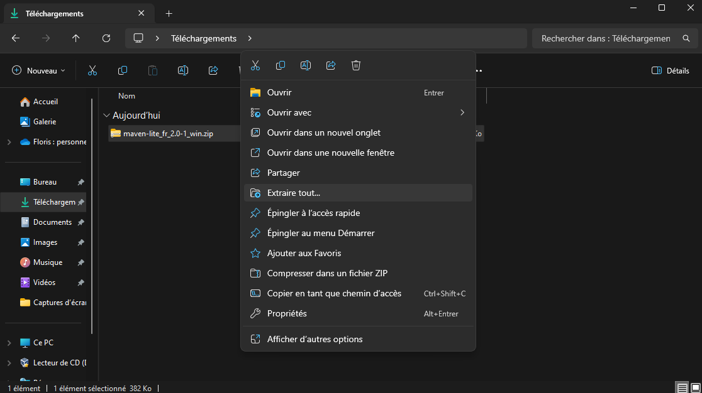

# Installation de Maven Lite sur Windows

<a href="https://florobart.github.io/Maven_lite/Documentations/Installation.fr.html"><button type="button">Retour</button></a>

- See the [English documentation](./Installation.en.md)
- Voir la [documentation en PDF](./Installation.fr.pdf)

## Table des matières

- [Installation de Maven Lite sur Windows](#installation-de-maven-lite-sur-windows)
  - [Table des matières](#table-des-matières)
  - [Installation automatique de Maven Lite - Windows (recommandé)](#installation-automatique-de-maven-lite---windows-recommandé)
  - [Installation manuelle de Maven Lite - Windows](#installation-manuelle-de-maven-lite---windows)

## Installation automatique de Maven Lite - Windows (recommandé)

- Téléchargez le [Fichier compressé de la version française](https://github.com/FloRobart/mavenlite.github.io/releases/download/v2.1.0/maven-lite_fr_2.0-1_win.zip) contenant les fichiers de l'applications.
- Décompressez le fichier compressé en faisant un clic droit sur le fichier et en cliquant sur `Extraire tout...`
  
- Validez la décompression dans le dossier de votre choix en cliquant sur `Extraire`
  
- Éxecuter le script d'installation `installer.bat` en faisant un clic droit dessus et en cliquant sur `Exécuter en tant qu'administrateur`
  
- Vous devriez voir une fenêtre de commande s'ouvrir et afficher un texte ressemblant à celui-ci
  
- Appuyez sur n'importe quelle touche pour fermer la fenêtre de commande
- Ajoutez le dossier `C:\Program Files\maven-lite` à la variable d'environnement système `PATH`
  - Éxecuter la commande suivante dans un terminal powershell en tant qu'administrateur OU si vous ne savez pas comment exécuter une commande suivez les instructions qui se trouvent en dessous de la commande

    ```powershell
    SETX PATH "%PATH%;C:\Program Files\maven-lite"
    ```

  - Si vous ne savez pas comment éxecuter la commande qui se trouve ci-dessus suivez les étapes suivantes
    - Ouvrez le menu démarrer
    - Tapez `variables d'environnement` et cliquez sur `Modifier les variables d'environnement système`
    - Cliquez sur `Variables d'environnement...`
    - Sélectionnez la variable système `Path` et cliquez sur `Modifier...`
    - Cliquez sur `Nouveau`
    - Tapez `C:\Program Files\maven-lite` et cliquez sur `OK`
    - Cliquez sur `OK`
    - Cliquez sur `OK`
- Vous pouvez supprimez le reste des fichiers inutilisés ainsi que le fichier compressé.

## Installation manuelle de Maven Lite - Windows

- Téléchargez le [Fichier compressé de la version française](https://github.com/FloRobart/mavenlite.github.io/releases/download/v2.1.0/maven-lite_fr_2.0-1_win.zip) contenant les fichiers de l'applications.
- Décompressez le fichier compressé en faisant un clic droit sur le fichier et en cliquant sur `Extraire tout...`
  
- Validez la décompression dans le dossier de votre choix en cliquant sur `Extraire`
  
- Créez le dossier `C:\Program Files\maven-lite`

  ```powershell
  mkdir 'C:\Program Files\maven-lite'
  ```

- Créez le dossier `C:\Program Files\maven-lite\etc`

  ```powershell
  mkdir 'C:\Program Files\maven-lite\etc'
  ```

- Déplacez les fichiers .class et .jar dans le dossier `C:\Program Files\maven-lite\etc`

  ```powershell
  MOVE hamcrest-core-1.3.jar 'C:\Program Files\maven-lite\etc'
  MOVE junit-4.13.2.jar 'C:\Program Files\maven-lite\etc'
  MOVE MavenLite.class 'C:\Program Files\maven-lite\etc'
  ```

- Déplacez les fichiers Batch dans le dossier `C:\Program Files\maven-lite`

  ```powershell
  MOVE mvnl.bat 'C:\Program Files\maven-lite'
  MOVE mvnl-uninstall.bat 'C:\Program Files\maven-lite'
  ```

- Ajoutez le dossier `C:\Program Files\maven-lite` à la variable d'environnement système `PATH`
  - Éxecuter la commande suivante dans un terminal powershell en tant qu'administrateur OU si vous ne savez pas comment exécuter une commande suivez les instructions qui se trouvent en dessous de la commande

    ```powershell
    SETX PATH "%PATH%;C:\Program Files\maven-lite"
    ```

  - Si vous ne savez pas comment éxecuter la commande qui se trouve ci-dessus suivez les étapes suivantes
    - Ouvrez le menu démarrer
    - Tapez `variables d'environnement` et cliquez sur `Modifier les variables d'environnement système`
    - Cliquez sur `Variables d'environnement...`
    - Sélectionnez la variable système `Path` et cliquez sur `Modifier...`
    - Cliquez sur `Nouveau`
    - Tapez `C:\Program Files\maven-lite` et cliquez sur `OK`
    - Cliquez sur `OK`
    - Cliquez sur `OK`
- Vous pouvez supprimez le reste des fichiers inutilisés ainsi que le fichier compressé.

****

<a href="https://florobart.github.io/Maven_lite/Documentations/Installation.fr.html"><button type="button">Retour</button></a>
